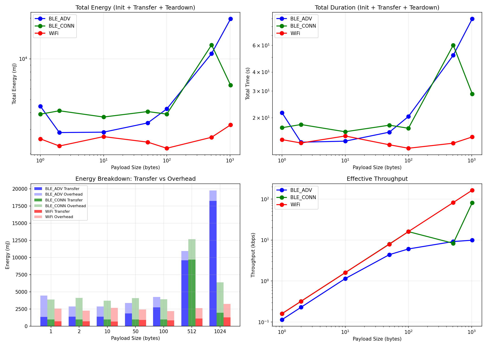

# XiFi Power Measurement Study

A comparative analysis of BLE and WiFi power consumption on ESP32-C5 to inform adaptive protocol selection for video streaming.

---

## Overview

This study measures the energy cost of different wireless protocols to answer a key question: **When should a device use BLE vs WiFi for data transfer?**

The motivation comes from a video streaming scenario where:
- A sender sleeps between bursts to save power
- A receiver advertises via BLE when its buffer runs low
- The sender wakes, scans for the BLE signal, sends a WiFi burst, then sleeps again

To design this algorithm, we needed real power measurements across different payload sizes and protocols.

---

## Hardware Setup

### Components

| Component | Purpose |
|-----------|---------|
| **Logger ESP32-C5** | Measures power consumption via INA219 sensor |
| **DUT ESP32-C5** | Device under test - runs BLE/WiFi transfers |
| **Peer ESP32-C5** | Acts as BLE server and WiFi AP for DUT to connect to |
| **INA219** | Current/voltage sensor (I2C interface) |

### Physical Connections

```
┌─────────────────┐         ┌─────────────────┐
│   Logger ESP    │         │    DUT ESP      │
│                 │         │                 │
│  GPIO 6 (SCL) ──┼────┐    │                 │
│  GPIO 7 (SDA) ──┼──┐ │    │                 │
│  GPIO 5 (IN) ───┼──┼─┼────┼── GPIO 4 (OUT)  │  ← Marker Signal
│  GND ───────────┼──┼─┼────┼── GND           │
│                 │  │ │    │                 │
└─────────────────┘  │ │    │  VIN ←──────────┼─── INA219 V-
                     │ │    │                 │
                     │ │    └─────────────────┘
                     │ │
              ┌──────┴─┴──────┐
              │    INA219     │
              │               │
              │  SDA ─────────┤ (to GPIO 7)
              │  SCL ─────────┤ (to GPIO 6)
              │  VCC ─────────┤ Logger 3.3V
              │  GND ─────────┤ Logger GND
              │               │
              │  VIN+ ────────┤ Power Source +
              │  VIN- ────────┤ → DUT VIN
              └───────────────┘
```

**Key point:** The INA219 sits in series with the DUT's power supply, measuring all current flowing into the DUT.

### Marker Signal

A GPIO connection between DUT and Logger marks the "transfer phase":
- **HIGH (1)**: Data transfer in progress
- **LOW (0)**: Init, teardown, or idle

This lets us separate transfer energy from overhead energy in the analysis.

---

## Firmware

### Logger ESP (`Logger_ESP/Logger_ESP.ino`)

Samples power at 20Hz and stores up to 6000 samples (~5 minutes). Controlled via Serial commands.

**Commands:**
- `start` - Begin recording
- `stop` - Stop recording
- `status` - Show sample count
- `csv` - Dump data as CSV

**Key snippet - Power sampling:**
```cpp
void loop() {
    if (recording && sampleCount < BUFFER_SIZE) {
        unsigned long now = millis();
        if (now - lastSample >= sampleInterval) {
            float voltage = ina.getBusVoltage_V();
            float current = ina.getCurrent_mA();
            int marker = digitalRead(MARKER_PIN);

            samples[sampleCount++] = {
                now - startTime,
                voltage,
                current,
                voltage * current,  // power in mW
                marker
            };
            lastSample = now;
        }
    }
}
```

### DUT ESP (`DUT_ESP/DUT_ESP.ino`)

Runs a single test based on compile-time defines. Executes 100 iterations of the selected protocol.

**Configuration:**
```cpp
#define TEST_MODE 3        // 1=BLE_ADV, 2=BLE_CONN, 3=WIFI
#define PAYLOAD_SIZE 512   // bytes per transfer
```

**Test modes:**
1. **BLE_ADV** - Broadcasts payload in BLE advertisement manufacturer data
2. **BLE_CONN** - Connects to Peer's GATT server, writes to characteristic
3. **WiFi** - Connects to Peer's AP, sends TCP packets

**Key snippet - Marker usage:**
```cpp
void runTest() {
    initProtocol();
    delay(1000);

    digitalWrite(MARKER_PIN, HIGH);  // Transfer phase starts
    for (int i = 0; i < 100; i++) {
        sendPayload();
    }
    digitalWrite(MARKER_PIN, LOW);   // Transfer phase ends

    deinitProtocol();
}
```

### Peer ESP (`Peer_ESP/Peer_ESP.ino`)

Provides endpoints for DUT to connect to:
- **WiFi AP**: SSID `XiFi-Peer`, password `xifi1234`
- **TCP Server**: Port 8080, receives and discards data
- **BLE GATT Server**: Writable characteristic for BLE_CONN mode

---

## Data Collection

### Test Matrix

| Payload Size | BLE_ADV | BLE_CONN | WiFi |
|--------------|---------|----------|------|
| 1 byte | ✓ | ✓ | ✓ |
| 2 bytes | ✓ | ✓ | ✓ |
| 10 bytes | ✓ | ✓ | ✓ |
| 50 bytes | ✓ | ✓ | ✓ |
| 100 bytes | ✓ | ✓ | ✓ |
| 512 bytes | ✓ | ✓ | ✓ |
| 1024 bytes | ✓ | ✓ | ✓ |

**Total: 21 test runs**

### Procedure

1. Flash Peer ESP, verify BLE advertising and WiFi AP visible
2. Flash Logger ESP, open Serial monitor
3. Flash DUT with desired `TEST_MODE` and `PAYLOAD_SIZE`
4. On Logger: type `start` to begin recording
5. Reset DUT to run the test
6. Wait for DUT to complete (Serial shows "Test complete")
7. On Logger: type `stop`, then `csv`
8. Copy CSV output to `Data/<size> Bytes/<mode>.csv`

### CSV Format

```csv
timestamp_ms,voltage_V,current_mA,power_mW,marker
0,3.28,45.2,148.26,0
50,3.28,47.1,154.49,0
100,3.27,89.3,292.01,1
...
```

---

## Analysis Scripts

### `scripts/analyze_data.py`

Compares **transfer phase only** across protocols. Calculates:
- Transfer duration
- Average power during transfer
- Energy per byte efficiency

Use this when you want to compare raw protocol performance without init/teardown overhead.

### `scripts/analyze_full_energy.py`

Analyzes **total energy cost** including initialization and teardown. This reflects real-world usage where you pay the full cost each time you use a protocol.

Also includes a hybrid scenario analysis comparing:
- WiFi only
- BLE_CONN only
- Hybrid (WiFi burst + BLE scan for wake signal)

### `scripts/plot_power.py`

Visualizes a single test CSV showing current, power, and voltage over time. The transfer phase is highlighted in green.

```bash
python scripts/plot_power.py Data/512\ Bytes/WiFi.csv
```

---

## Results

### Full Energy (Init + Transfer + Teardown)



### Transfer Phase Only


The transfer phase analysis isolates just the data transmission period (marker=1), excluding initialization and teardown overhead. This shows the raw protocol efficiency.

### Key Findings

| Payload | Best Protocol | Why |
|---------|---------------|-----|
| 1-10 bytes | WiFi | Faster completion offsets higher power |
| 50-100 bytes | WiFi | 3-4x faster than BLE |
| 512-1024 bytes | WiFi | 10x+ faster, much lower total energy |

**WiFi wins across all payload sizes** in total energy consumption.

### Energy Breakdown

| Mode | Small Payload Overhead | Large Payload Overhead |
|------|----------------------|----------------------|
| BLE_ADV | ~50-70% | ~10% |
| BLE_CONN | ~75% | ~45% |
| WiFi | ~60-70% | ~45% |

The overhead percentage drops as payload size increases because transfer time dominates.

### Numbers at a Glance (512 bytes, 100 iterations)

| Protocol | Total Energy | Duration | Throughput |
|----------|-------------|----------|------------|
| BLE_ADV | 10,937 mJ | 51.6s | 9.2 kbps |
| BLE_CONN | 12,675 mJ | 60.2s | 8.3 kbps |
| **WiFi** | **2,628 mJ** | **13.6s** | **82 kbps** |

WiFi uses **4x less energy** than BLE for the same data transfer.

---

## Conclusion

### What We Learned

1. **WiFi is more energy-efficient than BLE** for actual data transfer, despite drawing more instantaneous power. The key factor is throughput - WiFi finishes so much faster that total energy is lower.

2. **Protocol overhead is significant** - initialization and teardown can account for 50-75% of total energy for small payloads.

3. **BLE's advantage is not in data transfer** - it's in low-power listening/advertising for signaling.

### Algorithm Direction

Based on these measurements, the hybrid algorithm should:

```
┌─────────────────────────────────────────────────────────┐
│                    RECEIVER SIDE                        │
├─────────────────────────────────────────────────────────┤
│  1. Play video from buffer                              │
│  2. When buffer < threshold:                            │
│     → Start BLE advertising "NEED_DATA"                 │
│  3. When WiFi data arrives:                             │
│     → Stop BLE advertising                              │
│     → Buffer the data                                   │
└─────────────────────────────────────────────────────────┘

┌─────────────────────────────────────────────────────────┐
│                     SENDER SIDE                         │
├─────────────────────────────────────────────────────────┤
│  1. Deep sleep (very low power)                         │
│  2. Periodic BLE scan (~100ms every few seconds)        │
│  3. If "NEED_DATA" advertisement detected:              │
│     → Wake up WiFi                                      │
│     → Send burst of video data                          │
│     → Shut down WiFi                                    │
│     → Return to sleep                                   │
└─────────────────────────────────────────────────────────┘
```

**Why this works:**
- BLE scan is cheap (~6mJ for 100ms scan)
- WiFi burst is efficient for actual data
- Most time spent in deep sleep (~0.1mW)

**Next steps:**
1. Measure BLE scan energy more precisely
2. Implement the hybrid protocol on both sides
3. Compare total system energy vs always-on WiFi
4. Tune scan interval vs latency tradeoff

---

## Directory Structure

```
PowerTests/
├── Data/                    # Raw measurements (21 CSVs)
├── DUT_ESP/DUT_ESP.ino      # Test device firmware
├── Logger_ESP/Logger_ESP.ino # Power measurement firmware
├── Peer_ESP/Peer_ESP.ino    # BLE/WiFi endpoint firmware
├── scripts/
│   ├── analyze_data.py      # Transfer phase analysis
│   ├── analyze_full_energy.py # Full energy analysis
│   └── plot_power.py        # Single test visualization
├── results/                 # Generated CSV summaries
├── images/                  # Generated plots
├── HARDWARE_SETUP.md        # Wiring reference
└── REPORT.md               # This document
```

---

*Generated from XiFi Power Measurement Study, November 2024*
